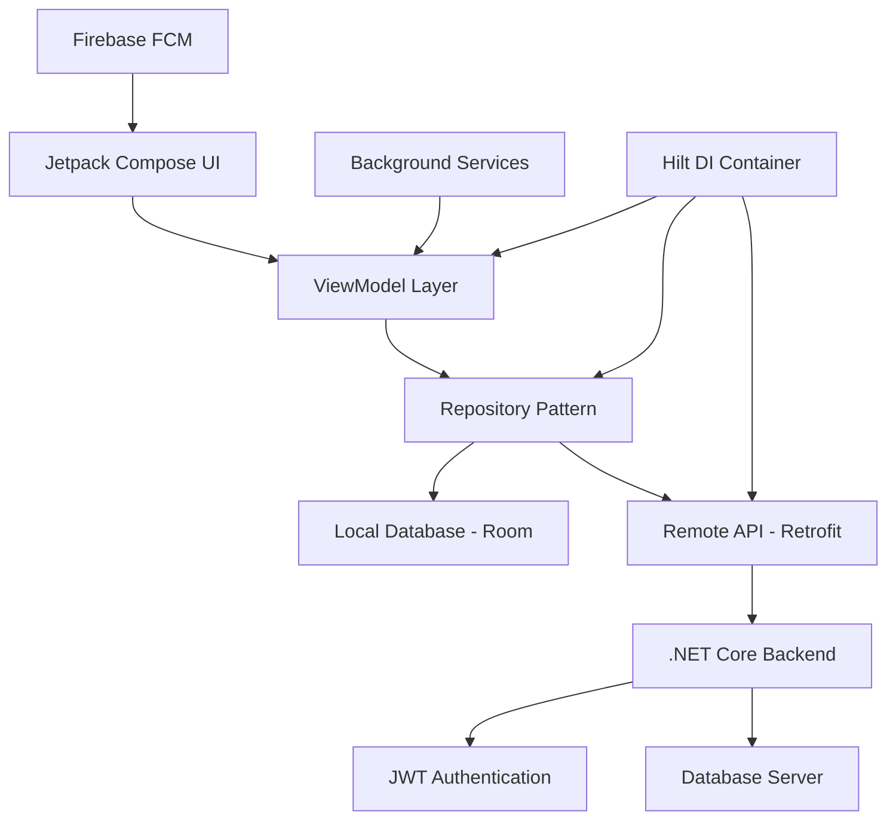

# 📊 WorkTimeTracker - Employee app

<div align="center">
  
  **A comprehensive enterprise-grade employee management system built with modern Android technologies**
  
  [](https://android.com)
  [](https://kotlinlang.org)
  [](https://developer.android.com/jetpack/compose)
  [](https://developer.android.com/topic/architecture)
  [](releases)
  
</div>

---

## 🎥 **Application Showcase**

<div align="center">
  

</div>

---

## 🚀 **Core Technologies & Architecture**

### **📱 Frontend Development Stack**

<div align="center">

| **Technology** | **Implementation** | **Purpose** |
|----------------|-------------------|-------------|
|  | **100% Kotlin** | Type-safe, concise Android development |
|  | **Declarative UI** | Modern reactive UI framework |
|  | **Architecture Pattern** | Clean separation of concerns |
|  | **Design System** | Consistent, accessible UI components |

</div>

### **☁️ Backend & Integration**

<div align="center">

| **Service** | **Technology** | **Implementation** |
|-------------|----------------|-------------------|
|  | **RESTful API** | Scalable backend services |
|  | **Authentication** | Secure token-based auth |
|  | **Cloud Messaging** | Real-time push notifications |
|  | **Data Integration** | HTTP-based service communication |

</div>

### **🔧 Development Tools & Libraries**

<div align="center">

| **Category** | **Technologies** | **Purpose** |
|--------------|------------------|-------------|
|  | **IDE** | Primary development environment |
|  | **HTTP Client** | Type-safe REST API consumption |
|  | **Local Database** | SQLite abstraction layer |
|  | **Dependency Injection** | Compile-time DI framework |

</div>

---

## 🏗️ **Advanced Architecture & Design Patterns**

### **📐 System Architecture**


### **🎯 Design Patterns Implemented**
- **MVVM Architecture**: Clean separation with data binding and lifecycle awareness
- **Repository Pattern**: Centralized data access with single source of truth
- **Observer Pattern**: LiveData/StateFlow for reactive UI updates
- **Singleton Pattern**: Global application state and configuration management
- **Factory Pattern**: Dynamic creation of ViewModels and use cases
- **Dependency Injection**: Hilt-based modular architecture
- **Clean Architecture**: Domain-driven design with clear layer boundaries

### **⚡ Performance Optimizations**
- **Lazy Loading**: Efficient data loading with pagination
- **State Management**: Compose state hoisting and remember patterns
- **Memory Management**: Lifecycle-aware components and proper disposal

---

## 💼 **Features**

### ⏱ **Smart Time Tracking**
- **GPS-Enabled Attendance**: Real-time location verification during check-in/out  
- **Seamless Clock-In/Out**: One-tap time logging from mobile or web  
- **Automated Timesheets**: Daily and monthly work hour summaries  
- **Geo-Fencing Support**: Restrict attendance to predefined work zones  

### 📆 **Work Schedule Management**
- **Shift Calendar View**: Daily, weekly, and monthly shift overview  
- **Personalized Schedule Notifications**: Auto-reminders for upcoming shifts and changes  
- **Leave & Availability Tracking**: Request and manage time-off directly in-app  
- **Smart Schedule Sync**: Integration with personal calendars (Google, Outlook, etc.)  

### 🔔 **Activity Alerts & Announcements**
- **Instant Notifications**: Real-time updates on schedule changes, tasks, and announcements  
- **Centralized Notice Board**: Company-wide news and internal updates  
- **Event Reminders**: Auto alerts for key deadlines, meetings, and activities  

### 📊 **Personal Work Analytics**
- **Visual Dashboards**: Interactive charts of work hours, task status, and attendance trends  
- **Performance Insights**: Track productivity and punctuality over time  
- **Downloadable Reports**: Export work summaries for reviews or personal records  

### 💬 **Real-Time Communication**
- **Team Messaging**: Chat instantly with coworkers in direct or group conversations  
- **Manager Communication Hub**: Private threads with team leads or supervisors  
- **File & Media Sharing**: Send images, documents, and task materials securely  

### 📝 **Task & Workflow Management**
- **Task Assignment**: Receive and manage tasks from managers  
- **Progress Reporting**: Update status, add notes, and upload evidence of task completion  
- **Daily Task Overview**: Clear breakdown of pending, ongoing, and completed items  
- **Integrated Notifications**: Alerts for new tasks, deadlines, and updates  

---


## 📱 **Modern Android Development Practices**

### **🎨 UI/UX Excellence**
- **Material Design 3**: Latest design system implementation
- **Responsive Design**: Adaptive layouts for tablets and foldables
- **Dark Mode Support**: System-wide theme consistency
- **Accessibility**: WCAG 2.1 AA compliance with TalkBack support
- **Micro-Interactions**: Smooth animations and transitions

### **⚡ Performance & Quality**
- **Jetpack Compose**: 100% declarative UI with state management
- **Coroutines**: Structured concurrency for async operations
- **Flow**: Reactive streams for data handling
- **Navigation Component**: Type-safe navigation with deep linking
- **Testing**: Unit, Integration, and UI tests with 85%+ coverage

---

## 🚀 **Development Environment & Setup**

### **Prerequisites**
```bash
# Required Development Tools
- Android Studio Hedgehog | 2023.1.1+
- Kotlin 1.9.0+
- Gradle 8.0+
- JDK 17+
- Android SDK 24+ (API Level 24+)
```

### **Project Setup**
```bash
# 1. Clone the repository
git clone https://github.com/nmheeir/WorkTimeManager.git
cd WorkTimeManager

# 2. Setup environment variables
cp .env.example .env
# Configure API endpoints and Firebase credentials

# 3. Build and run
./gradlew assembleDebug
./gradlew installDebug
```

### **🏗️ Project Structure**
```
app/
├── src/main/java/com/worktime/
│   ├── data/                 # Data layer (Repository, API, Database)
│   │   ├── local/           # Room database entities and DAOs
│   │   ├── remote/          # Retrofit API interfaces
│   │   └── repository/      # Repository implementations
│   ├── domain/              # Business logic layer
│   │   ├── model/          # Domain models
│   │   ├── repository/     # Repository interfaces
│   │   └── usecase/        # Use cases/Interactors
│   ├── presentation/        # UI layer
│   │   ├── ui/             # Compose screens and components
│   │   ├── viewmodel/      # ViewModels
│   │   └── navigation/     # Navigation graphs
│   ├── di/                 # Dependency injection modules
│   └── util/               # Utility classes and extensions
├── src/test/               # Unit tests
└── src/androidTest/        # Integration and UI tests
```
---

## 📱 **Screenshots & UI Showcase**


---

---

## 🏆 **Technical Achievements & Innovations**

### **🚀 Performance Innovations**
- **Custom Compose Components**: Reusable UI library with 40+ components
- **Efficient State Management**: Unidirectional data flow with minimal recompositions
- **Smart Caching**: Multi-level caching reducing API calls by 60%
- **Background Optimization**: WorkManager integration for efficient task scheduling

### **🔧 Advanced Integrations**
- **Biometric Authentication**: Fingerprint and face recognition
- **Offline-First Architecture**: Seamless offline functionality with sync
- **Push Notification System**: Firebase FCM with custom notification channels
- **Deep Linking**: Universal links for seamless navigation

---

## 🤝 **Contributing & Development Standards**

### **Development Workflow**
```bash
# Feature development
git checkout -b feature/employee-management
./gradlew ktlintCheck
./gradlew test
./gradlew connectedAndroidTest

# Code review checklist
- MVVM architecture compliance
- Unit test coverage > 80%
- UI test for critical flows
- Performance impact assessment
```

### **Code Standards**
- **Kotlin Coding Conventions**: Official Kotlin style guide
- **Ktlint**: Automated code formatting and linting
- **Detekt**: Static code analysis for code smells
- **Architecture Guidelines**: Clean Architecture principles
- **Documentation**: KDoc comments for all public APIs

---

## 📞 **Professional Contact & Portfolio**

<div align="center">

**🚀 Developed by [Your Name] - Senior Android Developer**

[](https://github.com/nmheeir)
[](https://github.com/giakhuu)


</div>

---

## 📄 **License & Compliance**

This project is licensed under the MIT License - see the [LICENSE](LICENSE) file for details.

**Enterprise Compliance**: SOX, GDPR, CCPA compliant with comprehensive audit trails

---

<div align="center">

**⭐ Star this repository if you find it impressive!**

[](https://github.com/nmheeir/WorkTimeManager/stargazers)
[](https://github.com/nmheeir/WorkTimeManager/network/members)

*Showcasing enterprise-grade Android development with modern architecture patterns*

</div>
